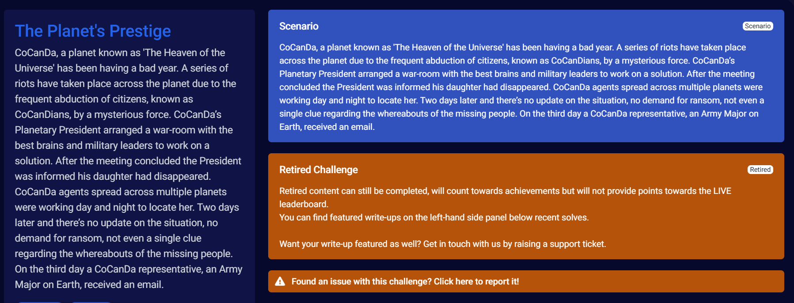
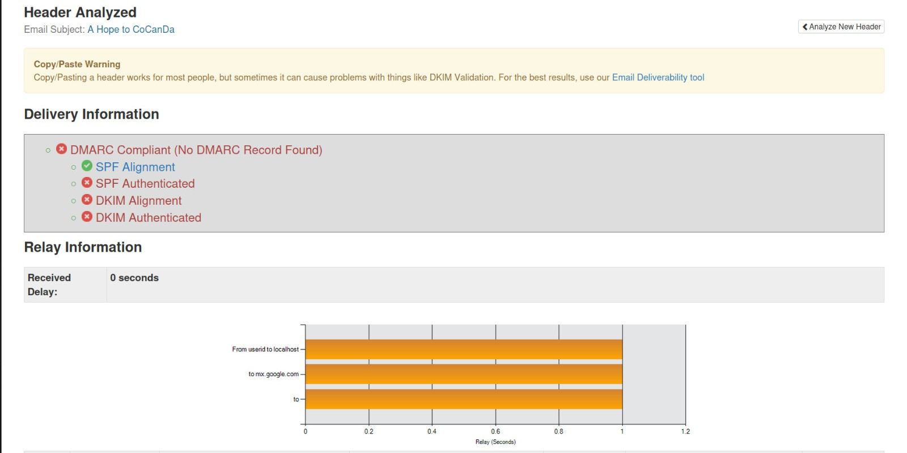
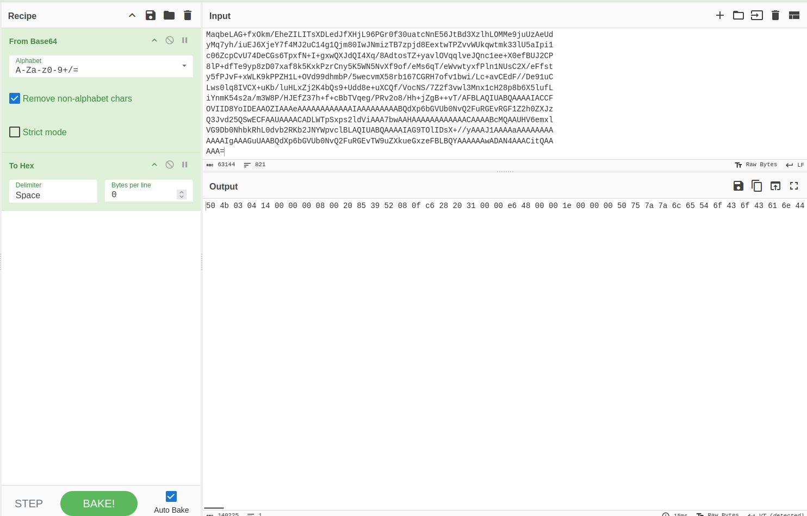
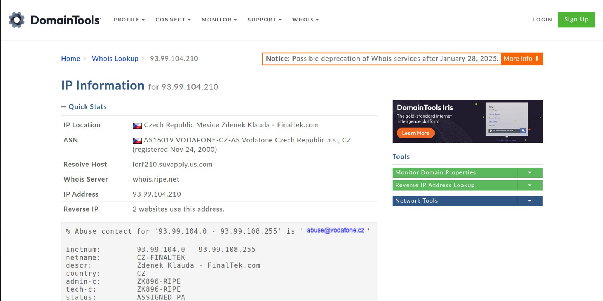
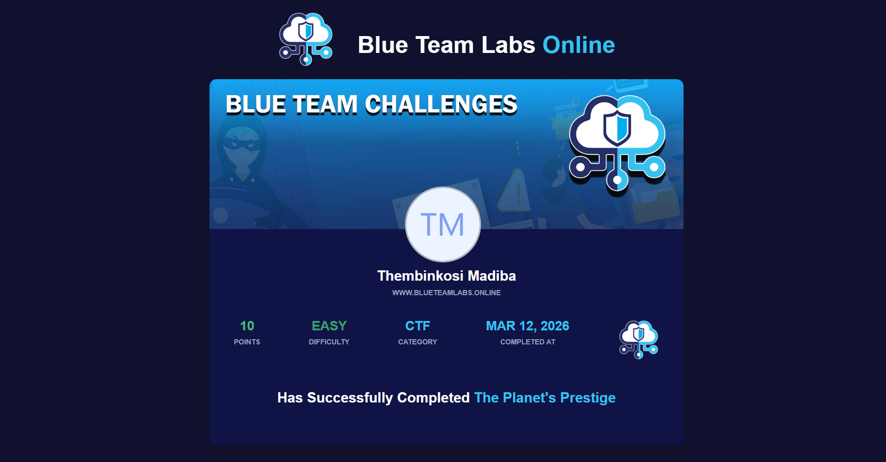

# Phishing Email Investigation – The Planet's Prestige (BTLO)

**Platform:** BlueTeam Labs Online  
**Challenge:** The Planet's Prestige  
**Category:** CTF / Email Forensics  
**Difficulty:** Easy  
**Points:** 10  
**Completed:** March 12, 2026  
**Status:** Closed – True Positive

---

## 1. Incident Overview

A suspicious email was submitted for analysis as part of the **The Planet's Prestige** CTF challenge on **BlueTeam Labs Online**. The task simulated a real-world SOC phishing triage workflow.

The email arrived with a vague subject line, a mismatched Reply-To address, and a **Base64-encoded attachment**. Full header analysis, authentication verification, payload decoding, and IP intelligence gathering were performed to determine whether the email was malicious.

The investigation confirmed this is a **phishing email with a potential malware delivery component**, targeting recipients through Apple brand impersonation.




---

## 2. Alert Metadata

- **From:** `billjobs@microapple.com`
- **Reply-To:** `negeja3921@pashter.com`
- **Subject:** `A Hope to CoCanDa`
- **Sender Domain:** `microapple.com`
- **Originating IP:** `93.99.104.210`
- **Attachment Encoding:** Base64
- **Decoded File Type:** ZIP Archive (`PK` magic bytes – `50 4B 03 04`)

---

## 3. Email Metadata Analysis

### Sender Details

| Field             | Value                        |
|-------------------|------------------------------|
| **From**          | `billjobs@microapple.com`    |
| **Reply-To**      | `negeja3921@pashter.com`     |
| **Subject**       | `A Hope to CoCanDa`          |
| **Sender Domain** | `microapple.com`             |

### Key Red Flags

- **Domain spoofing:** `microapple.com` impersonates Apple Inc. (`apple.com`) — not affiliated in any way
- **Reply-To mismatch:** Replies are silently redirected to `negeja3921@pashter.com`, an attacker-controlled inbox on a completely separate domain
- **Obfuscated subject line:** `"A Hope to CoCanDa"` is semantically meaningless — a known tactic to bypass keyword-based spam filters
- **Disposable reply address:** The string `negeja3921` is consistent with an auto-generated throwaway account used in phishing infrastructure

---

## 4. Email Authentication Analysis

### Results Summary

| Protocol  | Result       | Implication                                                        |
|-----------|--------------|--------------------------------------------------------------------|
| **SPF**   | ❌ FAIL      | Sending IP `93.99.104.210` is not authorized by `microapple.com`   |
| **DKIM**  | ❌ FAIL      | No valid cryptographic signature — content integrity unverifiable  |
| **DMARC** | ⚠️ MISSING   | No policy configured — no enforcement or abuse reporting in place  |

SPF failure confirms the sending IP is not an authorized mail server for the claimed domain. DKIM failure means the message cannot be verified as unmodified. The complete absence of a DMARC record suggests `microapple.com` was registered purely for malicious use — no legitimate mail infrastructure was ever set up.

> **Note:** Triple authentication failure (SPF + DKIM + no DMARC) is one of the strongest technical signals that an email is fraudulent.



---

## 5. Base64 Payload Analysis

The email contained an attachment encoded in **Base64** — a common obfuscation technique used to hide malicious file content from email security scanners and human reviewers.

### Step 1 — Decoding with CyberChef

The Base64 content was extracted and loaded into **CyberChef**. The `From Base64` operation was applied first to decode the raw bytes, followed by the **`To Hex`** operation to render the output in hexadecimal — this is the critical step for identifying the true file type regardless of what the email claims the attachment to be.



### Step 2 — File Signature Identification via Gary Kessler's Table

The attachment was presented as a **PDF file**. However, rather than accepting the file extension at face value, the hex output was cross-referenced against **[Gary Kessler's File Signatures Table](https://www.garykessler.net/library/file_sigs.html)** — a widely used reference in digital forensics that maps magic bytes to their true file types.

The decoded hex output began with:

```
50 4B 03 04
```

Checking this against Gary Kessler's table revealed this is **not** a PDF signature. A genuine PDF file would begin with:

```
25 50 44 46  (%PDF)
```

Instead, `50 4B 03 04` is the **PK magic bytes signature** — the universal file header for a **ZIP archive**.

| Indicator            | Expected (PDF)     | Actual (Decoded)              |
|----------------------|--------------------|-------------------------------|
| **Claimed Type**     | PDF                | —                             |
| **Magic Bytes**      | `25 50 44 46`      | `50 4B 03 04`                 |
| **True File Type**   | —                  | ZIP Archive                   |
| **Reference**        | —                  | Gary Kessler's File Signatures Table |

### Step 3 — ZIP Extraction

With the file correctly identified as a ZIP archive, it was extracted. The contents yielded additional artifacts that provided further evidence to complete the challenge investigation.

> **Analyst Note:** This step demonstrates why file extensions should never be trusted at face value during phishing analysis. Magic byte verification using a reference like Gary Kessler's table is a fundamental triage skill — it reveals what a file truly is, not what an attacker wants you to think it is.

---

## 6. IP Address Investigation

### Target IP: `93.99.104.210`

| Field              | Details                                             |
|--------------------|-----------------------------------------------------|
| **IP Address**     | `93.99.104.210`                                     |
| **Country**        | Latvia 🇱🇻                                           |
| **Hosting Type**   | Commercial VPS / hosting provider                   |
| **Association**    | No affiliation with Apple Inc. or legitimate mail providers |

The originating IP belongs to a commercial VPS provider in Latvia — a jurisdiction with no plausible connection to an Apple-branded sender. Threat actors routinely use VPS providers for phishing infrastructure due to easy provisioning and relative anonymity. The IP has no established reputation as a legitimate mail server, which further confirms fraudulent origin.



---

## 7. Indicators of Compromise (IOCs)

| IOC Type           | Value                         | Description                                      |
|--------------------|-------------------------------|--------------------------------------------------|
| **IP Address**     | `93.99.104.210`               | Originating mail server — Latvia VPS             |
| **Domain**         | `microapple.com`              | Sender domain — Apple brand impersonation        |
| **Domain**         | `pashter.com`                 | Reply-To domain — attacker-controlled inbox      |
| **Email Address**  | `billjobs@microapple.com`     | Sender address                                   |
| **Email Address**  | `negeja3921@pashter.com`      | Reply-To address — attacker-controlled           |
| **Subject Line**   | `A Hope to CoCanDa`           | Phishing lure — filter evasion via vague wording |
| **File Type**      | ZIP Archive (Base64-encoded)  | Attachment — potential malware delivery vehicle  |

---

## 8. MITRE ATT&CK Mapping

| Tactic             | Technique ID  | Technique Name                         |
|--------------------|---------------|----------------------------------------|
| Initial Access     | T1566.001     | Phishing: Spearphishing Attachment     |
| Defense Evasion    | T1036         | Masquerading (domain impersonation)    |
| Defense Evasion    | T1027         | Obfuscated Files or Information        |
| Command & Control  | T1071.003     | Application Layer Protocol: Mail       |

---

## 9. Attack Analysis

This email represents a **phishing attack with a malware delivery component**. The likely attack chain:

```
[Attacker sends from 93.99.104.210 — Latvia VPS]
        │
        ▼
[Spoofed domain: microapple.com — Apple impersonation]
[SPF fail | DKIM fail | No DMARC]
        │
        ▼
[Victim receives email — tricked by Apple brand association]
        │
        ▼
[Victim opens Base64-encoded ZIP attachment]
        │
        ▼
[ZIP executes payload — potential malware installation or credential theft]
        │
        ▼
[Any victim replies routed silently to: negeja3921@pashter.com]
```

The Reply-To mismatch serves a dual purpose: it routes victim responses to an attacker-controlled inbox while keeping the visible sender domain contextually relevant to the impersonated brand.

---

## 10. Detection and Mitigation

**Immediate Actions**

- 🔴 Block IP `93.99.104.210` at the email gateway and perimeter firewall
- 🔴 Block domains `microapple.com` and `pashter.com` in DNS filtering and email security
- 🔴 Quarantine any emails matching subject `"A Hope to CoCanDa"`
- 🔴 Alert users who may have received or interacted with this email

**Strategic Controls**

| Control                   | Recommendation                                                                  |
|---------------------------|---------------------------------------------------------------------------------|
| **SPF Enforcement**       | Quarantine or reject SPF-failing inbound mail at the gateway                   |
| **DKIM Verification**     | Flag unsigned or unverifiable messages for analyst review                       |
| **DMARC Policy**          | Enforce `p=reject` on impersonated domains                                      |
| **Attachment Sandboxing** | Detonate ZIP and encoded attachments in a sandbox before delivery               |
| **Base64 Scanning**       | Configure DLP/email security to decode and inspect Base64-encoded attachments   |
| **Reply-To Alerting**     | Flag emails where Reply-To domain differs significantly from the From domain    |

---

## 11. Final Verdict

- **True Positive** — Phishing confirmed
- Apple brand impersonation via fraudulent sender domain (`microapple.com`)
- Triple authentication failure: SPF ❌ DKIM ❌ DMARC ⚠️ missing
- Base64-encoded ZIP attachment indicating payload delivery intent
- Originating infrastructure: commercial VPS in Latvia with no legitimate mail history
- Reply-To hijacking to redirect victim communications to attacker inbox

The email is malicious. All associated IOCs should be actioned across relevant security controls.

---

## 12. Certification



| Field                | Details                                                                          |
|----------------------|----------------------------------------------------------------------------------|
| **Recipient**        | Thembinkosi Madiba                                                               |
| **Challenge**        | The Planet's Prestige                                                            |
| **Platform**         | BlueTeam Labs Online                                                             |
| **Category**         | CTF                                                                              |
| **Difficulty**       | Easy                                                                             |
| **Points Awarded**   | 10                                                                               |
| **Completed**        | March 12, 2026                                                                   |
| **Verification URL** | [View Certificate](https://blueteamlabs.online/achievement/share/challenge/149863/10) |

---

## 13. Skills Demonstrated

- Email header analysis
- Phishing detection and triage
- Email authentication analysis (SPF, DKIM, DMARC)
- Base64 decoding
- Hex analysis using CyberChef
- Magic byte / file signature verification (Gary Kessler's File Signatures Table)
- File type spoofing detection
- ZIP archive extraction and artifact analysis
- IP threat intelligence and geolocation
- IOC identification and documentation
- MITRE ATT&CK mapping
- Defensive recommendations for SOC teams

---

## 14. Tools Used

| Tool                              | Purpose                                                         |
|-----------------------------------|-----------------------------------------------------------------|
| **MXToolbox**                     | Email header analysis and authentication checks                 |
| **CyberChef**                     | Base64 decoding and hex conversion for file type identification |
| **Gary Kessler's File Signatures**| Magic bytes reference for true file type verification           |
| **DomainTools**                   | IP intelligence and geolocation lookup                          |
| **BlueTeam Labs Online**          | CTF challenge platform                                          |

